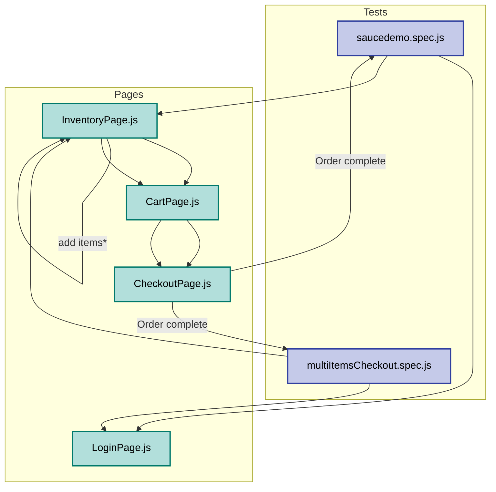
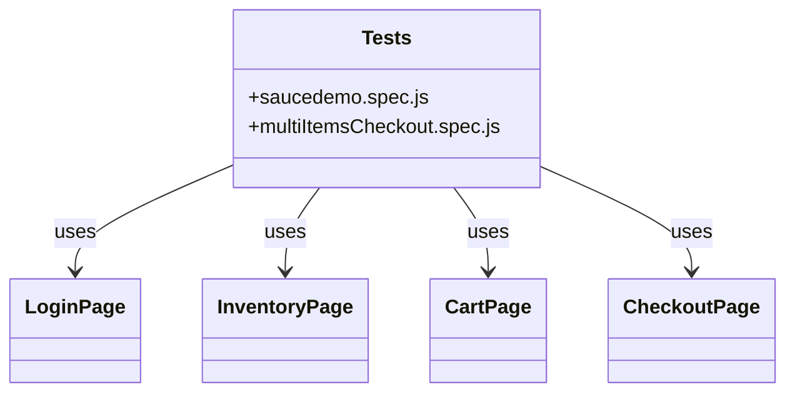

# Test Flow Diagram

```mermaid
flowchart TD
    %% ==================== TEST FILES =====================
    subgraph Tests
        SingleItemTest["saucedemo.spec.js"]
        MultiItemTest["multiItemsCheckout.spec.js"]
    end

    %% =================== PAGE OBJECTS ====================
    subgraph Pages
        LoginPage["LoginPage.js"]
        InventoryPage["InventoryPage.js"]
        CartPage["CartPage.js"]
        CheckoutPage["CheckoutPage.js"]
    end

    %% ================ NAVIGATION FLOW ===================
    %% --- Single-item checkout ---
    SingleItemTest --> LoginPage
    SingleItemTest --> InventoryPage
    InventoryPage --> CartPage
    CartPage --> CheckoutPage
    CheckoutPage -->|Order&nbsp;complete| SingleItemTest

    %% --- Multi-item checkout (adds loop) ---
    MultiItemTest --> LoginPage
    MultiItemTest --> InventoryPage
    InventoryPage -->|add items*| InventoryPage
    InventoryPage --> CartPage
    CartPage --> CheckoutPage
    CheckoutPage -->|Order&nbsp;complete| MultiItemTest

    %% ====================== STYLES =======================
    classDef test fill:#C5CAE9,stroke:#303F9F,stroke-width:2px,color:#000;
    classDef page fill:#B2DFDB,stroke:#00796B,stroke-width:2px,color:#000;

    class SingleItemTest,MultiItemTest test;
class LoginPage,InventoryPage,CartPage,CheckoutPage page;

```

## UML Class Diagram

```mermaid
classDiagram
    class Tests {
        +saucedemo.spec.js
        +multiItemsCheckout.spec.js
    }

    class LoginPage
    class InventoryPage
    class CartPage
    class CheckoutPage

    Tests --> LoginPage : uses
    Tests --> InventoryPage : uses
    Tests --> CartPage : uses
    Tests --> CheckoutPage : uses
```
