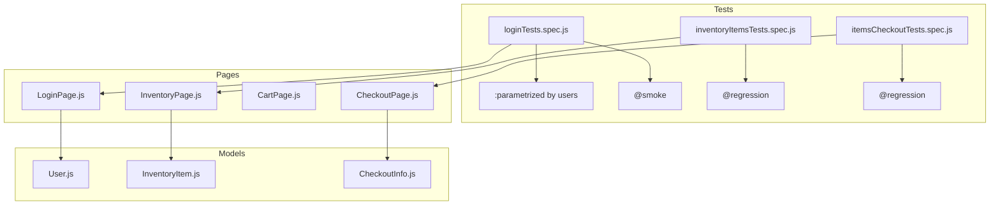
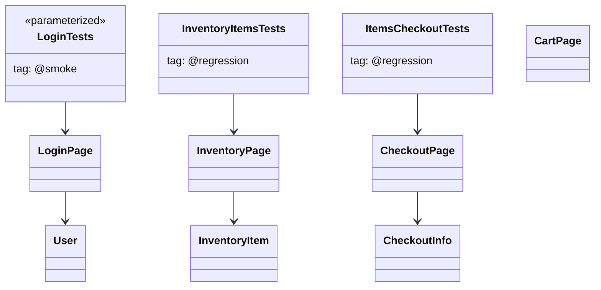

# Test Flow Diagram

**Diagram notes:**
- loginTests.spec.js generates multiple tests via parameterization (looping over a users array).
- Tag-based filtering: login tests use '@smoke' in titles; inventory and checkout tests use '@regression'.

## UML Class Diagram (Minimal for Mermaid compatibility)

**UML notes:**
- `<<parameterized>>` indicates that LoginTests are generated from user data.
- "tag: ..." indicates what tag is present in test titles for Playwright's `--grep` filter.
- Include tags directly in the first argument (test title) string for Playwright CLI filtering.

_Note: If errors persist, your Mermaid parser/editor may have custom restrictions. You can further simplify by removing all arrows and only listing class names._
