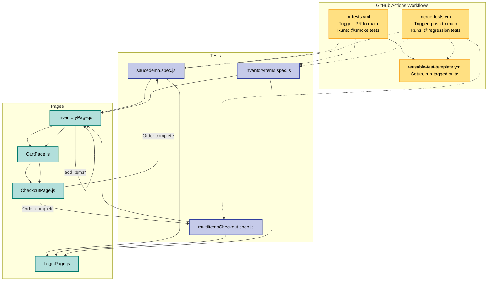
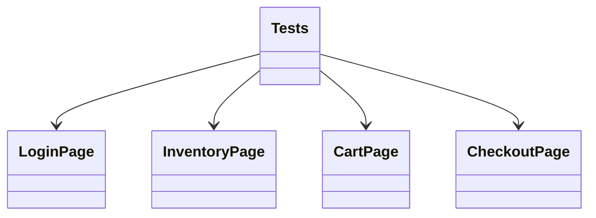

# Test Flow Diagram

## UML Class Diagram

**CI workflows:**  

- `pr-tests.yml` runs `@smoke` tests on PR to main  
- `merge-tests.yml` runs `@regression` tests on push to main  
- Both invoke `reusable-test-template.yml` for setup and execution.

