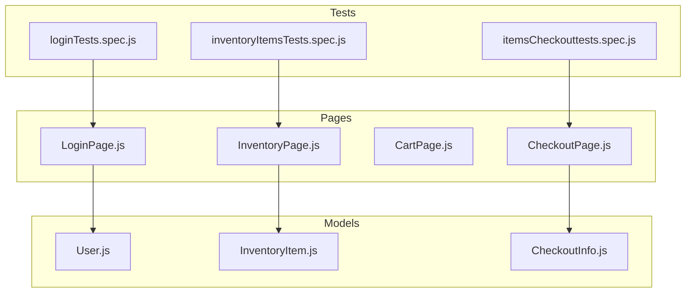
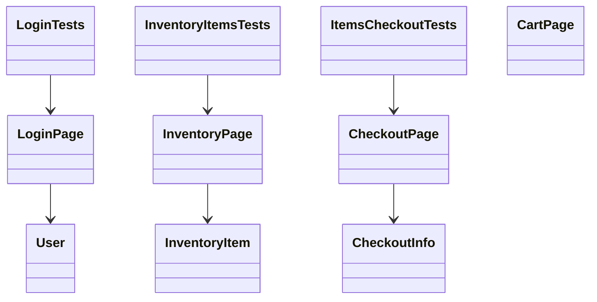

# Test Flow Diagram

## UML Class Diagram (Minimal for Mermaid compatibility)

_Note: If errors persist, your Mermaid parser/editor may have custom restrictions. You can further simplify by removing all arrows and only listing class names._
